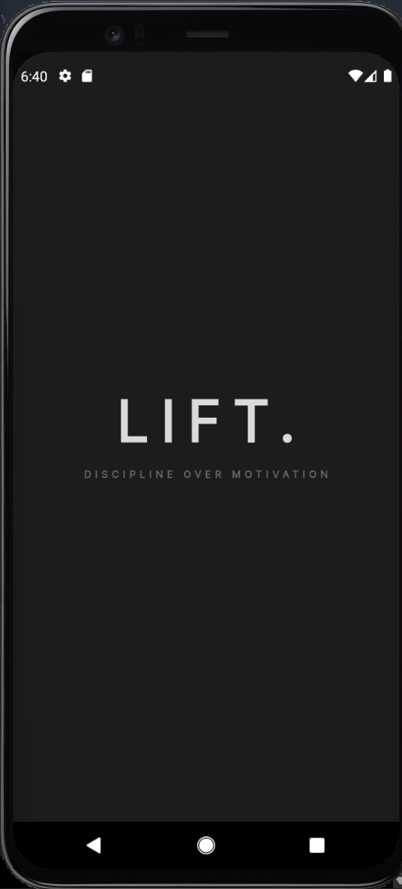
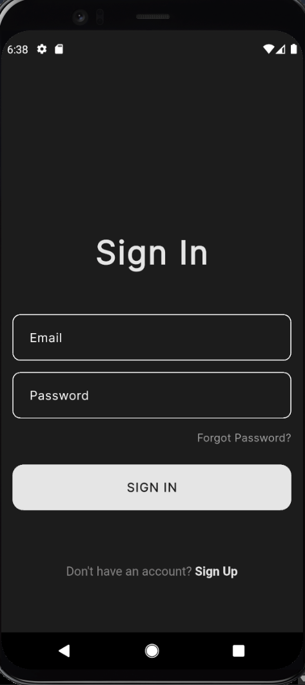
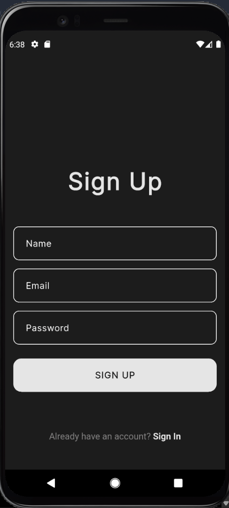
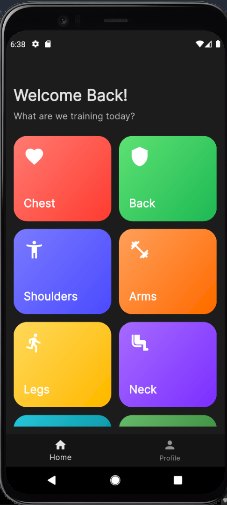
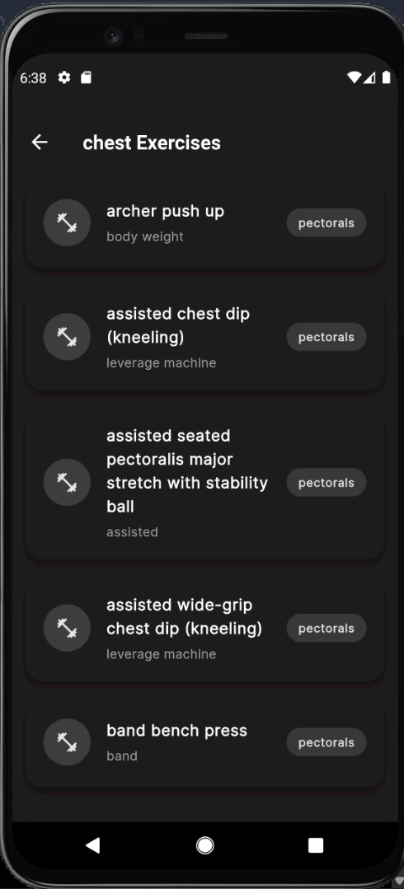
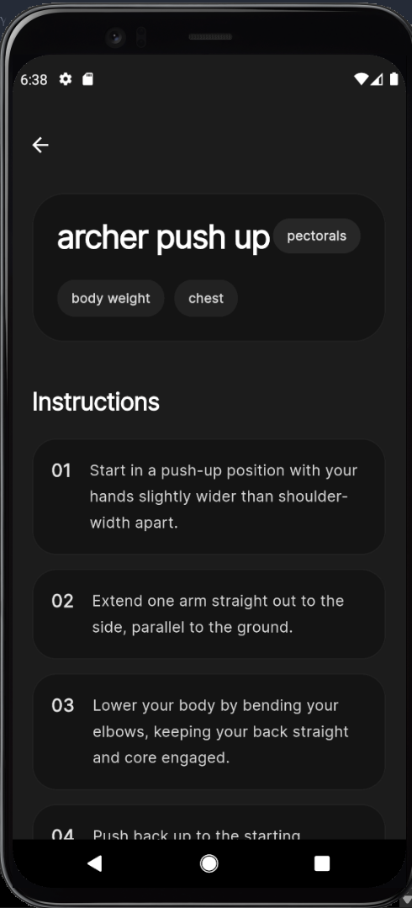
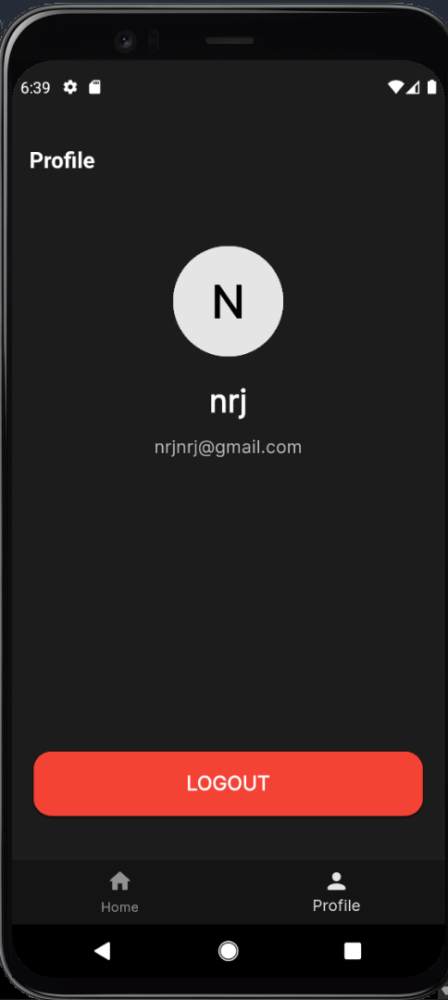

# LIFT — Gym Exercise App

LIFT is a modern Flutter fitness application built with Firebase Authentication, BLoC architecture, and ExerciseDB API integration. The app allows users to authenticate, browse exercises by muscle group, and view detailed exercise information inside a clean premium UI.

---

# Features

- Firebase Authentication
  - Sign Up
  - Login
  - Persistent Session
  - Logout

- Exercise Browsing
  - Chest
  - Back
  - Shoulders
  - Arms
  - Legs
  - Core
  - Cardio
  - More body parts

- Exercise Details
  - Exercise Name
  - Target Muscle
  - Equipment
  - Instructions
  - Secondary Muscles

- Modern UI
  - Dark aesthetic interface
  - Animated splash screen
  - Premium card-based layouts
  - Smooth navigation

- Architecture
  - BLoC State Management
  - Service Layer
  - Clean reusable structure

---

# Tech Stack

- Flutter
- Dart
- Firebase Authentication
- flutter_bloc
- HTTP Package
- ExerciseDB API

---

# Project Architecture

UI
↓
BLoC
↓
Service Layer
↓
API

---

# Packages Used

```yaml
firebase_auth
firebase_core
flutter_bloc
bloc
http
```

---

# Screenshots

## Splash Screen



---

## Sign In Screen



---

## Sign Up Screen



---

## Home Screen



---

## Exercise Screen



---

## Details Screen



---

## Profile Screen



Example:

- Splash Screen
- Login Screen
- Home Screen
- Exercise Screen
- Exercise Detail Screen
- Profile Screen

---

# Setup Instructions

1. Clone the repository

```bash
git clone https://github.com/NeerajSangwan/lift_app.git
```

2. Install dependencies

```bash
flutter pub get
```

3. Run the app

```bash
flutter run
```

---

# API Used

ExerciseDB API

https://exercisedb.p.rapidapi.com

---

# Author

Neeraj Sangwan
